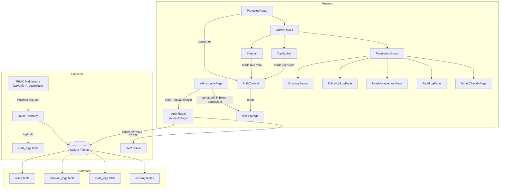

# Design Document: RBAC Multi-User Authentication

## Overview

This design replaces the existing single-password admin authentication with a full Role-Based Access Control (RBAC) system. The current system uses one shared `ADMIN_PASSWORD` environment variable and a custom HMAC-signed session token. The new system introduces five roles (`developer`, `church_admin`, `followup_head`, `pastor`, `usher`), email + password login, JWT-based sessions, and three new modules (Follow-Up Log, User Management, Audit Log).

The migration is designed to be non-breaking for the public-facing routes and to preserve all existing admin page structure. The approach is a thin-wrapper pattern: existing pages are not redesigned; instead a `PermissionGuard` component wraps each route and conditionally renders or redirects based on role.

### Key Design Decisions

1. **JWT via `jsonwebtoken`** — already present in the backend `node_modules` (used by `@anthropic-ai/sdk` transitively). We add it as an explicit direct dependency.
2. **`bcryptjs` for password hashing** — pure-JS implementation, no native bindings required, works on Render/Vercel without build issues. Added to backend dependencies.
3. **`AuthContext` wraps `AdminLayout`** — the context is provided at the `ProtectedRoute` level so all admin children can consume it.
4. **Role-permission config object** — a single `ROLE_PERMISSIONS` constant in `frontend/src/config/permissions.js` is the single source of truth for both the Sidebar and PermissionGuard.
5. **Thin wrapper pattern** — existing pages receive a `readOnly` and `viewMode` prop from `PermissionGuard`; they do not need to know about roles directly.
6. **Audit logging helper** — a `logAudit(req, action, module, targetId)` function is called by every mutating route handler after a successful DB write.
7. **Idempotent seed** — seed runs inside `initializeDatabase()` only when `SELECT COUNT(*) FROM users` returns 0.

---

## Architecture



### Request Flow

1. User submits email + password on `AdminLoginPage`.
2. `POST /api/auth/login` validates credentials via bcrypt, issues a JWT (8-hour expiry) containing `{ id, name, email, role }`.
3. `AuthContext` stores `adminToken` (raw JWT) and `adminUser` (decoded payload) in `localStorage`.
4. All subsequent admin API requests include `Authorization: Bearer <token>`.
5. `RBAC_Middleware` verifies the JWT signature, checks expiry, checks `is_active`, attaches `req.user`, then calls `next()`.
6. Route handlers optionally call `requireRole(...roles)` for fine-grained endpoint protection.
7. After successful mutating operations, route handlers call `logAudit(req, action, module, targetId)`.

---

## Components and Interfaces

### Backend

#### `backend/server/routes/auth.js` (replaced)

The existing HMAC-based auth route is replaced entirely.

```
POST /api/auth/login
  Body: { email: string, password: string }
  Response 200: { token: string, user: { id, name, email, role } }
  Response 401: { error: "Invalid email or password" }
  Response 403: { error: "Account is deactivated. Contact your administrator." }
  Response 429: { error: "Too many login attempts. Please try again in 15 minutes." }
```

Rate limiting (5 attempts / 15 min per IP) is preserved from the existing implementation.

#### `backend/server/middleware/auth.js` (replaced)

The existing HMAC-verification middleware is replaced with JWT verification.

```javascript
// New exports:
authMiddleware(req, res, next)   // verifies JWT, checks is_active, attaches req.user
requireRole(...roles)            // returns middleware that checks req.user.role
```

`authMiddleware` reads `Authorization: Bearer <token>`, verifies with `jwt.verify(token, JWT_SECRET)`, queries `users` table to confirm `is_active`, then sets `req.user`.

**Environment variable**: `JWT_SECRET` (new, required). Falls back to `SESSION_SECRET` for the transitional period.

#### `backend/server/routes/users.js` (new)

```
GET    /api/users              → requireRole('developer') → list all users
POST   /api/users              → requireRole('developer') → create user
PATCH  /api/users/:id          → requireRole('developer') → update role / is_active
DELETE /api/users/:id          → requireRole('developer') → delete user
```

#### `backend/server/routes/followup.js` (new)

```
GET    /api/followup-logs      → requireRole('developer','followup_head') → list (scoped)
POST   /api/followup-logs      → requireRole('developer','followup_head') → create
PATCH  /api/followup-logs/:id  → requireRole('developer','followup_head') → update status
GET    /api/followup-logs/export → requireRole('developer','followup_head') → PDF export (scoped)
```

#### `backend/server/routes/audit.js` (new)

```
GET    /api/audit              → requireRole('developer') → list entries (filters: date, user, role, action, module)
```

No DELETE or PATCH endpoints are exposed.

#### `backend/server/helpers/auditLogger.js` (new)

```javascript
async function logAudit(req, action, module, targetId) {
  // action: 'create' | 'update' | 'delete' | 'export'
  // Writes to audit_logs table
  // Does NOT throw — errors are logged to console only
}
```

Called by every mutating route handler after a successful DB write. Never called when `RBAC_Middleware` rejects a request.

#### `backend/server/routes/checkin.js` (new)

```
GET  /api/checkin/search?q=   → requireRole('developer','usher') → search members
POST /api/checkin/mark         → requireRole('developer','usher') → mark attendance
GET  /api/checkin/headcount    → requireRole('developer','usher') → live count for current event
```

### Frontend

#### `frontend/src/config/permissions.js` (new)

Single source of truth for role-permission mapping.

```javascript
export const ROLE_PERMISSIONS = {
  developer:      { routes: ['*'], ... },
  church_admin:   { routes: [...], ... },
  followup_head:  { routes: [...], ... },
  pastor:         { routes: [...], readOnly: ['events','prayer','testimonies'], ... },
  usher:          { routes: ['/admin/check-in'], redirectTo: '/admin/check-in' },
};

export const ROLE_LABELS = {
  developer:     'Developer',
  church_admin:  'Church Admin',
  followup_head: 'Follow-Up Head',
  pastor:        'Pastor',
  usher:         'Usher',
};

export const ROLE_COLORS = {
  developer:     '#ef4444',
  church_admin:  '#2563eb',
  followup_head: '#7c3aed',
  pastor:        '#16a34a',
  usher:         '#d97706',
};
```

#### `frontend/src/context/AuthContext.jsx` (new)

```javascript
// Provides: { user, token, login(token, user), logout(), isAuthenticated }
// On mount: reads adminToken from localStorage, decodes it, checks expiry
// On expiry: clears storage, redirects to /admin/login
// login(): stores adminToken + adminUser, sets state
// logout(): removes adminToken + adminUser, redirects to /admin/login
```

Wraps `ProtectedRoute` in `main.jsx` so all admin children can consume it via `useAuth()`.

#### `frontend/src/components/Admin/ProtectedRoute.jsx` (updated)

Reads `user` and `isAuthenticated` from `AuthContext` instead of raw `localStorage` keys. Redirects to `/admin/login` if not authenticated. Redirects usher to `/admin/check-in` on login.

#### `frontend/src/components/Admin/PermissionGuard.jsx` (new)

```jsx
// Props: { route: string, children: ReactNode }
// Reads role from AuthContext
// If route not permitted: redirects to /admin/live (or /admin/check-in for usher) + shows toast
// If route permitted with restrictions: clones children with { readOnly, viewMode } props
```

Wraps each `<Route>` element in `main.jsx`.

#### `frontend/src/components/Admin/Sidebar.jsx` (updated)

Reads `user.role` from `AuthContext`. Filters nav items against `ROLE_PERMISSIONS[role].routes`. Logout calls `AuthContext.logout()` instead of directly clearing `adminKey`/`adminTokenExpiry`.

#### `frontend/src/components/Admin/TopNavbar.jsx` (updated)

Reads `user` from `AuthContext`. Displays `user.name` and a `RoleBadge` component. Replaces `x-admin-key` header with `Authorization: Bearer <token>` in all fetch calls.

#### `frontend/src/components/Admin/RoleBadge.jsx` (new)

```jsx
// Props: { role: string }
// Renders a pill with ROLE_LABELS[role] text and ROLE_COLORS[role] background
```

#### `frontend/src/pages/Admin/FollowUpLogPage.jsx` (new)

Table view of follow-up log entries. Filters by date range, status, Done By. Create entry form (action_type, note, status). PDF export button (scoped by role).

#### `frontend/src/pages/Admin/UserManagementPage.jsx` (new)

Table of users with Name, Email, Role badge, Status, Last Login, Created Date. Actions: Create, Edit role, Deactivate/Reactivate, Delete. Temp password modal on create when email not configured.

#### `frontend/src/pages/Admin/AuditLogPage.jsx` (new)

Read-only table of audit log entries in reverse chronological order. Filters: date range, user, role, action type, module. No delete or edit controls.

#### `frontend/src/pages/Admin/UsherCheckInPage.jsx` (new)

Mobile-first (375px+) check-in interface. Search by name or unique code. Display member name on match. Mark attendance button. Live headcount display.

#### `frontend/src/services/api.js` (updated)

Add `getAuthHeaders()` helper:

```javascript
export function getAuthHeaders() {
  const token = localStorage.getItem('adminToken');
  return token ? { 'Authorization': `Bearer ${token}` } : {};
}
```

All admin API calls migrate from `{ 'x-admin-key': adminKey }` to `{ ...getAuthHeaders() }`.

---

## Data Models

### `users` table

```sql
CREATE TABLE IF NOT EXISTS users (
  id           TEXT PRIMARY KEY DEFAULT (lower(hex(randomblob(16)))),
  name         TEXT NOT NULL,
  email        TEXT NOT NULL UNIQUE,
  password_hash TEXT NOT NULL,
  role         TEXT NOT NULL CHECK(role IN ('developer','church_admin','followup_head','pastor','usher')),
  is_active    INTEGER NOT NULL DEFAULT 1,
  last_login   TEXT,
  created_at   TEXT NOT NULL DEFAULT (datetime('now')),
  created_by   TEXT REFERENCES users(id)
);
```

### `followup_logs` table

```sql
CREATE TABLE IF NOT EXISTS followup_logs (
  id          TEXT PRIMARY KEY DEFAULT (lower(hex(randomblob(16)))),
  member_id   TEXT NOT NULL REFERENCES members(id),
  action_type TEXT NOT NULL CHECK(action_type IN ('called','visited','note','resolved')),
  note        TEXT,
  done_by     TEXT NOT NULL REFERENCES users(id),
  status      TEXT NOT NULL DEFAULT 'pending' CHECK(status IN ('pending','in_progress','resolved')),
  created_at  TEXT NOT NULL DEFAULT (datetime('now'))
);
```

### `audit_logs` table

```sql
CREATE TABLE IF NOT EXISTS audit_logs (
  id         TEXT PRIMARY KEY DEFAULT (lower(hex(randomblob(16)))),
  user_id    TEXT NOT NULL REFERENCES users(id),
  role       TEXT NOT NULL,
  action     TEXT NOT NULL CHECK(action IN ('create','update','delete','export')),
  module     TEXT NOT NULL,
  target_id  TEXT,
  ip_address TEXT,
  created_at TEXT NOT NULL DEFAULT (datetime('now'))
);
```

### JWT Payload

```json
{
  "id":    "uuid",
  "name":  "John Doe",
  "email": "john@example.com",
  "role":  "church_admin",
  "iat":   1700000000,
  "exp":   1700028800
}
```

### localStorage Keys (post-migration)

| Key | Value | Replaces |
|-----|-------|---------|
| `adminToken` | Raw JWT string | `adminKey` |
| `adminUser` | JSON-stringified `{ id, name, email, role }` | `adminTokenExpiry` |

---

## Correctness Properties

*A property is a characteristic or behavior that should hold true across all valid executions of a system — essentially, a formal statement about what the system should do. Properties serve as the bridge between human-readable specifications and machine-verifiable correctness guarantees.*

### Property 1: JWT payload completeness and expiry

*For any* valid user record in the `users` table, a successful login SHALL return a JWT whose decoded payload contains `id`, `name`, `email`, and `role` matching the user record, and whose `exp` field is within 8 hours (± 5 seconds) of the time of issuance.

**Validates: Requirements 1.2**

---

### Property 2: Invalid credentials always return 401 with the exact message

*For any* email not present in the `users` table, or *for any* valid email paired with an incorrect password, the login endpoint SHALL return HTTP 401 with the body `{ "error": "Invalid email or password" }`.

**Validates: Requirements 1.3, 1.4**

---

### Property 3: Deactivated user login returns 403

*For any* user record where `is_active = false`, submitting their correct credentials SHALL return HTTP 403 with the body `{ "error": "Account is deactivated. Contact your administrator." }`.

**Validates: Requirements 1.5, 2.6**

---

### Property 4: Passwords are stored as bcrypt hashes with cost factor ≥ 12

*For any* user created through the system (via seed or User Management), the stored `password_hash` SHALL match the bcrypt format `$2b$12$...` (or higher cost factor), and `bcrypt.compare(plaintext, hash)` SHALL return `true` for the original password.

**Validates: Requirements 1.6, 9.7, 11.3**

---

### Property 5: Successful login updates last_login

*For any* valid user, after a successful login, the `last_login` field in the `users` table SHALL be updated to a timestamp within 5 seconds of the login time.

**Validates: Requirements 1.7**

---

### Property 6: Empty-field form submission is rejected client-side

*For any* combination of empty email or empty password in the login form, the form SHALL not submit a network request and SHALL display an inline validation error.

**Validates: Requirements 1.9**

---

### Property 7: localStorage keys are correct after login

*For any* successful login response, `localStorage.getItem('adminToken')` SHALL equal the JWT string returned by the server, and `JSON.parse(localStorage.getItem('adminUser'))` SHALL equal the decoded user payload `{ id, name, email, role }`.

**Validates: Requirements 2.1**

---

### Property 8: Unauthenticated requests to protected routes return 401

*For any* `/admin/*` API route, a request sent without an `Authorization` header SHALL return HTTP 401.

**Validates: Requirements 2.4**

---

### Property 9: Invalid or expired JWT returns 401

*For any* `/admin/*` API route, a request sent with a JWT whose signature is invalid or whose `exp` has passed SHALL return HTTP 401.

**Validates: Requirements 2.5**

---

### Property 10: requireRole rejects unauthorised roles

*For any* role `R` and any allowed-roles list `L` where `R ∉ L`, a request authenticated as role `R` to an endpoint protected by `requireRole(...L)` SHALL return HTTP 403.

**Validates: Requirements 3.1, 3.2, 3.3, 3.4, 3.5, 3.6, 3.7**

---

### Property 11: Follow-up log export is scoped by role

*For any* `followup_head` user `U`, the follow-up log export endpoint SHALL return only entries where `done_by = U.id`. *For any* `developer` user, the same endpoint SHALL return all entries regardless of `done_by`.

**Validates: Requirements 3.8, 8.7, 8.8**

---

### Property 12: Sidebar renders only permitted nav items

*For any* role `R`, rendering the `Sidebar` component with `AuthContext` providing role `R` SHALL produce a nav item list that is a subset of the permitted routes for `R` as defined in `ROLE_PERMISSIONS`, and SHALL NOT include any nav item for a route not permitted for `R`.

**Validates: Requirements 4.1, 5.4**

---

### Property 13: PermissionGuard redirects unpermitted routes

*For any* role `R` and any route path `P` not in `ROLE_PERMISSIONS[R].routes`, navigating to `P` SHALL trigger a redirect to `/admin/live` (or `/admin/check-in` for usher) and SHALL display the Access_Denied_Toast.

**Validates: Requirements 4.2, 6.7**

---

### Property 14: Export button visibility follows role

*For any* user with role `church_admin` or `developer`, the Dashboard SHALL render the Export Data button. *For any* user with any other role, the Export Data button SHALL be absent from the Dashboard.

**Validates: Requirements 4.9**

---

### Property 15: TopNavbar displays correct name and role badge

*For any* authenticated user object `{ name, role }` in `AuthContext`, the `TopNavbar` SHALL render the user's `name` and a `RoleBadge` whose label equals `ROLE_LABELS[role]` and whose colour equals `ROLE_COLORS[role]`.

**Validates: Requirements 5.1, 5.2, 5.3**

---

### Property 16: Usher check-in search returns matching members

*For any* member in the database, searching the check-in page by the member's name or unique code SHALL return a result set that includes that member.

**Validates: Requirements 6.4**

---

### Property 17: Usher headcount matches actual attendance

*For any* set of attendance records for the current event, the headcount displayed on the check-in page SHALL equal the count of those records.

**Validates: Requirements 6.6**

---

### Property 18: Follow-up log filtering is correct

*For any* combination of filter values (date range, status, done_by), all entries returned by the Follow-Up Log module SHALL satisfy every active filter criterion, and no entry that satisfies all criteria SHALL be omitted.

**Validates: Requirements 8.3**

---

### Property 19: done_by is always the requesting user's id

*For any* `followup_head` or `developer` user `U` who creates a follow-up log entry, the stored `done_by` field SHALL equal `U.id`.

**Validates: Requirements 8.4**

---

### Property 20: action_type and status enums are enforced

*For any* value of `action_type` not in `{called, visited, note, resolved}`, or *for any* value of `status` not in `{pending, in_progress, resolved}`, the follow-up log create endpoint SHALL return an error response (HTTP 400 or 422).

**Validates: Requirements 8.5, 8.6**

---

### Property 21: Deactivated user's JWT is rejected

*For any* user `U` who has a valid JWT, after `U.is_active` is set to `false`, any subsequent request using that JWT to any protected route SHALL return HTTP 403.

**Validates: Requirements 9.5**

---

### Property 22: Every mutating action produces an audit log entry

*For any* user `U` performing a `create`, `update`, `delete`, or `export` action on any module, after the action completes successfully, the `audit_logs` table SHALL contain a new entry with `user_id = U.id`, `role = U.role`, the correct `action`, `module`, `target_id`, and a `created_at` within 5 seconds of the action time.

**Validates: Requirements 10.2**

---

### Property 23: Rejected requests do not produce audit log entries

*For any* request rejected by `RBAC_Middleware` with HTTP 403, the count of rows in `audit_logs` SHALL NOT increase.

**Validates: Requirements 10.6**

---

### Property 24: Audit log entries cannot be deleted or modified

*For any* user role (including `developer`), a DELETE or PATCH request to `/api/audit` or `/api/audit/:id` SHALL return HTTP 403 or 405.

**Validates: Requirements 10.5**

---

### Property 25: Seed is idempotent

*For any* number of times `initializeDatabase()` is called on a database that already contains user records, the count of rows in the `users` table SHALL NOT increase beyond the count present before the call.

**Validates: Requirements 11.4**

---

## Error Handling

### Backend

| Scenario | HTTP Status | Response Body |
|----------|-------------|---------------|
| Missing `Authorization` header | 401 | `{ "error": "Unauthorized: No token provided" }` |
| Invalid JWT signature | 401 | `{ "error": "Unauthorized: Invalid token" }` |
| Expired JWT | 401 | `{ "error": "Unauthorized: Token expired, please log in again" }` |
| Valid JWT, `is_active = false` | 403 | `{ "error": "Forbidden: Account is deactivated" }` |
| Role not in allowed list | 403 | `{ "error": "Forbidden: Insufficient permissions" }` |
| Invalid `action_type` or `status` enum | 400 | `{ "error": "Invalid value for field: <field>" }` |
| `JWT_SECRET` not set | 500 | `{ "error": "Server misconfigured: JWT_SECRET not set" }` (logged as FATAL) |
| bcrypt compare failure | 500 | `{ "error": "Login failed" }` (internal error logged) |

The `logAudit` helper is designed to never throw — it catches and logs errors internally so that a failed audit write does not cause the primary operation to fail.

### Frontend

| Scenario | Behaviour |
|----------|-----------|
| Expired token detected on mount | `AuthContext` clears storage, redirects to `/admin/login` |
| API returns 401 | `AuthContext` clears storage, redirects to `/admin/login` (via a global response interceptor in `api.js`) |
| API returns 403 | `PermissionGuard` shows `Access_Denied_Toast`, redirects to `/admin/live` |
| Login form: empty field | Inline validation error, no network request |
| Login form: server error | Error message displayed below form |
| Temp password modal: dismissed | Password is no longer recoverable; user must be recreated |

### Migration / Backward Compatibility

During the transitional release cycle, the backend will:
1. Accept the old `x-admin-key` / `ADMIN_PASSWORD` flow on `/api/auth/login` if `email` is absent from the request body and `ADMIN_PASSWORD` is set.
2. Log a deprecation warning when the old flow is used.
3. The old `adminKey` / `adminTokenExpiry` localStorage keys are cleared on first load of the new `AuthContext`.

---

## Testing Strategy

### Unit Tests (Jest + React Testing Library)

Focus on specific examples, edge cases, and error conditions:

- `AuthContext`: token expiry detection, login/logout state transitions, redirect behaviour.
- `PermissionGuard`: renders children for permitted routes, redirects for unpermitted routes, passes correct `readOnly` prop.
- `RoleBadge`: renders correct label and colour for each of the five roles.
- `Sidebar`: renders correct nav items for each role (snapshot per role).
- `AdminLoginPage`: empty field validation, error message display, successful login flow.
- `requireRole` middleware: unit test with mock `req.user` for each role combination.
- `logAudit` helper: verifies DB write on success, verifies no throw on DB error.
- `authMiddleware`: missing header, invalid JWT, expired JWT, deactivated user.

### Property-Based Tests (fast-check, minimum 100 iterations per property)

Each property test is tagged with a comment referencing the design property number.

**Tag format:** `// Feature: rbac-multi-user-auth, Property N: <property_text>`

Properties to implement as property-based tests:

- **Property 2** — Generate random non-existent emails and random wrong passwords; verify 401 + exact message.
- **Property 3** — Generate random deactivated users; verify 403 + exact message.
- **Property 4** — Generate random plaintext passwords; create user; verify stored hash format and bcrypt.compare round-trip.
- **Property 6** — Generate random combinations of empty/non-empty email and password; verify no network request when either is empty.
- **Property 7** — Generate random valid login responses; verify localStorage keys are set correctly.
- **Property 8** — Generate random protected route paths; verify 401 without Authorization header.
- **Property 9** — Generate random invalid/expired JWTs; verify 401.
- **Property 10** — Generate random (role, allowed-list) pairs where role ∉ list; verify 403.
- **Property 11** — Generate random sets of follow-up log entries with mixed `done_by` values; verify export scoping.
- **Property 12** — For each of the five roles, render Sidebar and verify nav items match `ROLE_PERMISSIONS`.
- **Property 13** — Generate random (role, route) pairs where route is not permitted; verify redirect.
- **Property 14** — For each role, render Dashboard and verify Export button presence/absence.
- **Property 15** — For each role, render TopNavbar and verify name and badge label/colour.
- **Property 18** — Generate random follow-up log datasets and filter combinations; verify filter correctness.
- **Property 19** — Generate random users and log entries; verify `done_by` equals creator's id.
- **Property 20** — Generate random invalid enum values; verify 400/422 response.
- **Property 21** — Generate random users; deactivate; verify JWT rejected.
- **Property 22** — Generate random mutating actions; verify audit log entry created.
- **Property 23** — Generate random rejected requests; verify audit log count unchanged.
- **Property 24** — For each role, attempt DELETE/PATCH on audit endpoint; verify 403/405.
- **Property 25** — Run `initializeDatabase()` multiple times on a seeded DB; verify user count unchanged.

**Library**: `fast-check` (frontend) and `fast-check` (backend via Jest).

**Configuration**: Each `fc.assert(fc.property(...))` call uses `{ numRuns: 100 }` minimum.

### Integration Tests

- Full login → JWT → protected route flow (real SQLite in-memory DB).
- Seed: fresh DB → verify five users exist with correct roles and bcrypt hashes.
- Audit log: perform create/update/delete on members → verify audit_logs entries.
- Follow-up log export scoping: create entries as two different users → verify each user's export is scoped.

### Smoke Tests

- After `initializeDatabase()`: verify `users`, `followup_logs`, `audit_logs` tables exist.
- After seed: verify five default users exist with correct emails and roles.
- `users` table schema: verify all columns (`id`, `name`, `email`, `password_hash`, `role`, `is_active`, `last_login`, `created_at`, `created_by`) exist.
- `followup_logs` table schema: verify all columns exist.
- `audit_logs` table schema: verify all columns exist.
- Usher check-in page: manual visual inspection at 375px viewport width.
